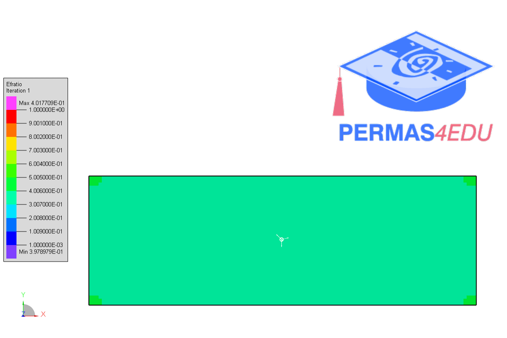

***
[⬅️](../029/README.md "Previous example")
[➡️](../031/README.md "Next example")
***

The example is adapted from [Increasing boundary resolution in topology optimization using a novel formulation of partial elements](https://doi.org/10.1007/s00158-025-04009-8)

