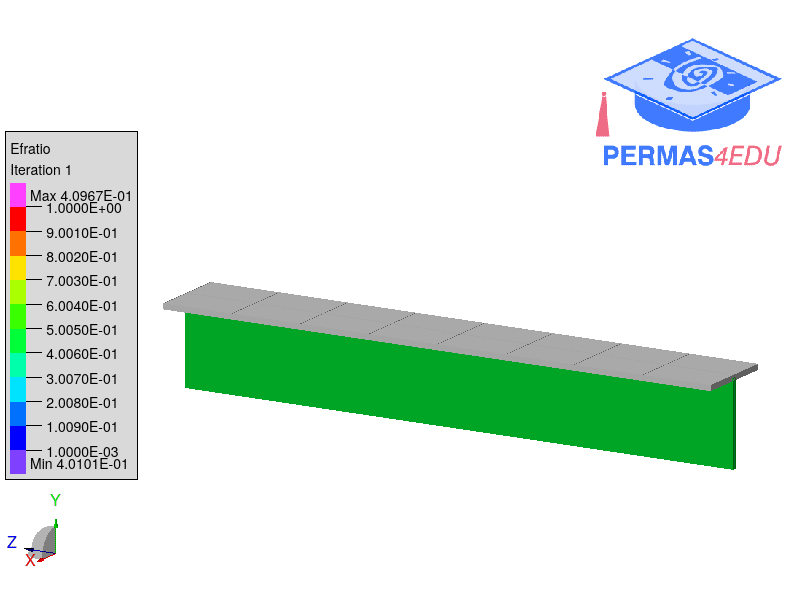
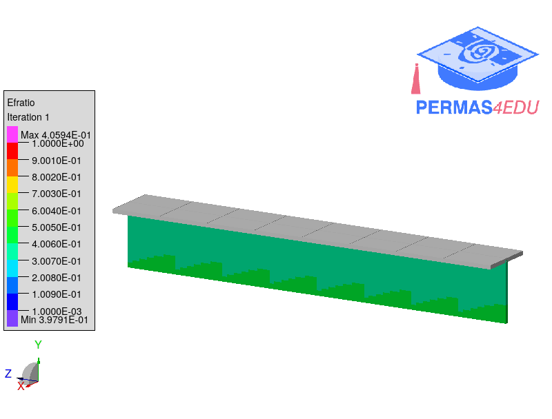
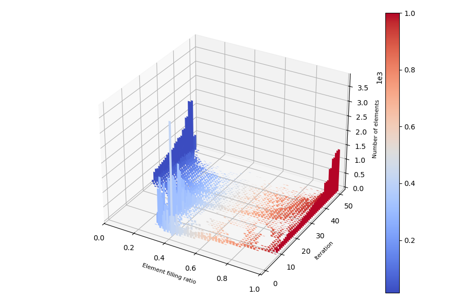

***
[⬅️](../030/README.md "Previous example")
[➡️](../032/README.md "Next example")
***

The example is adapted from [Topology Optimization of Periodic Structures Subject to Self-Weight Loading Using a Heuristic Method](https://doi.org/10.3390/ma17225652)

