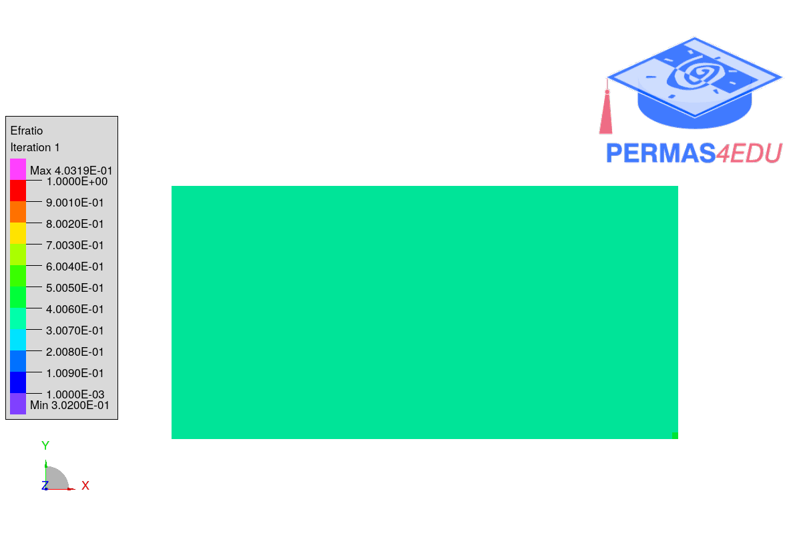

***
[⬅️](../032/README.md "Previous example")
[➡️](../034/README.md "Next example")
***

The example is adapted from [BESO Topology Optimization Driven by an ABAQUS-MATLAB Cooperative Framework with Engineering Applications](https://doi.org/10.3390/app15094924)

