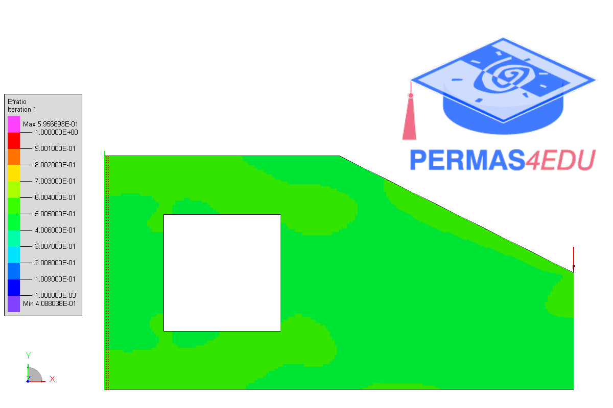

***
[⬅️](../035/README.md "Previous example")
[➡️](../037/README.md "Next example")
***

The example is adapted from [Structural topology optimization based on an immersed FEM Level‑Set method](https://doi.org/10.1007/s00158-025-04083-y)

