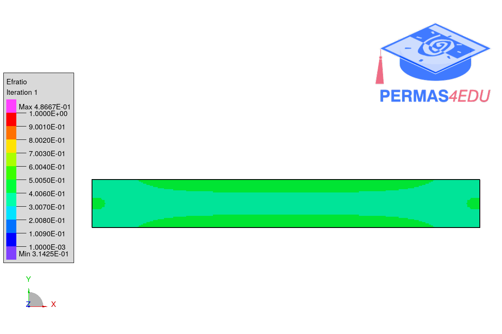

***
[⬅️](../036/README.md "Previous example")
[➡️](../038/README.md "Next example")
***

The example is adapted from [Topology optimization of eigenvalues for elastic structures by topological derivatives and time domain response](http://dx.doi.org/10.1299/mej.25-00129)

