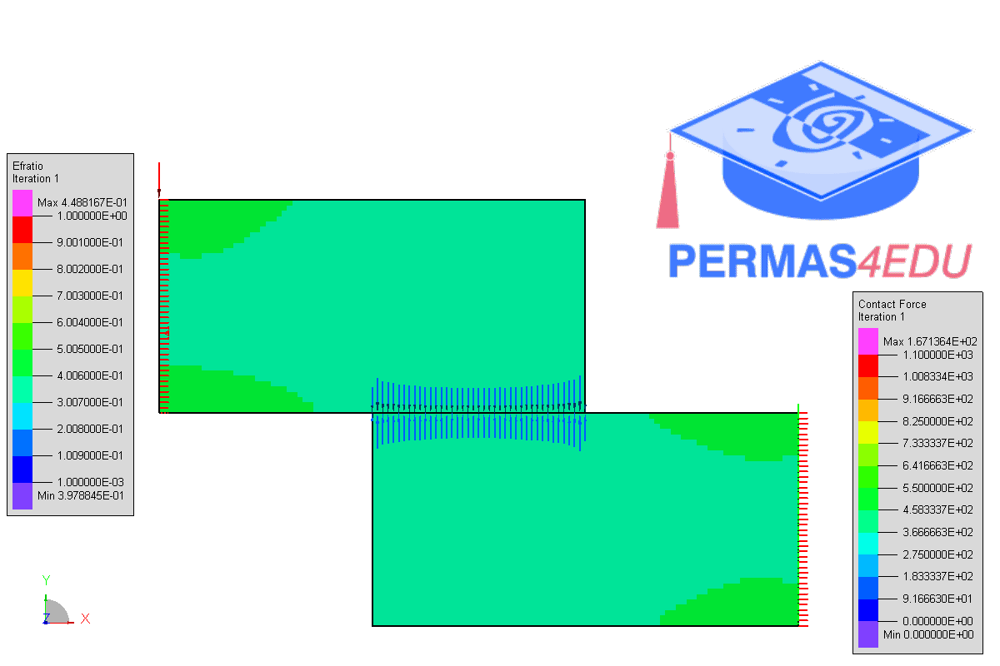

***
[⬅️](../037/README.md "Previous example")
[➡️](../039/README.md "Next example")
***

The example is adapted from [A 499-line MATLAB implementation for frictional contact topology optimization](https://doi.org/10.1007/s00158-025-04081-0)

