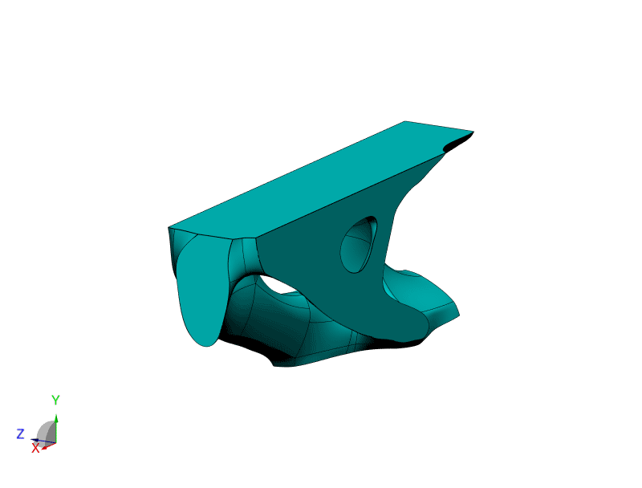

***
[⬅️](../039/README.md "Previous example")
[➡️](../041/README.md "Next example")
***

The examples are adapted from [A level set-based structural topology optimization method with centre of mass control](https://doi.org/10.1051/smdo/2025025)

### Cantilever beam

### Simply supported beam
