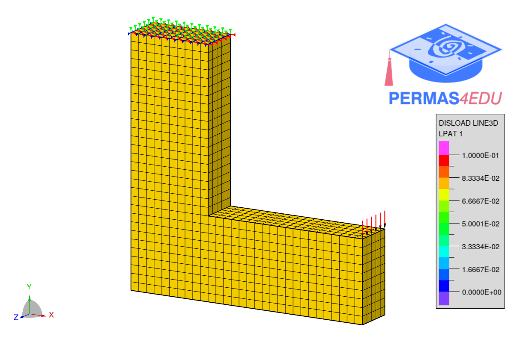

***
[⬅️](../040/README.md "Previous example")
[➡️](../042/README.md "Next example")
***

The example is adapted from [An Efficient Filter Implementation Method and Its Applications in Topology Optimization Utilizing k-d Tree Data Structure](https://doi.org/10.3390/computation13110262)

