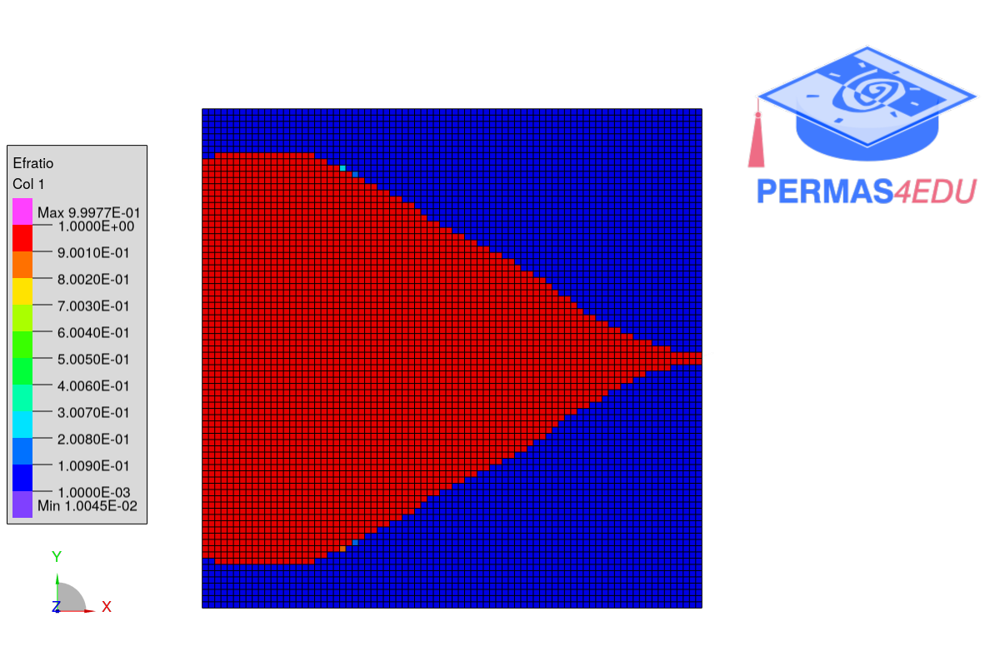

***
[⬅️](../041/README.md "Previous example")
[➡️](../README.md "Go up one directory level")
***
The  examples are adapted from [Topology Optimization of Undamped Plates for the Maximization of the Fundamental Frequency](https://www.researchgate.net/publication/397973751_Topology_Optimization_of_Undamped_Plates_for_the_Maximization_of_the_Fundamental_Frequency)

### Case B

