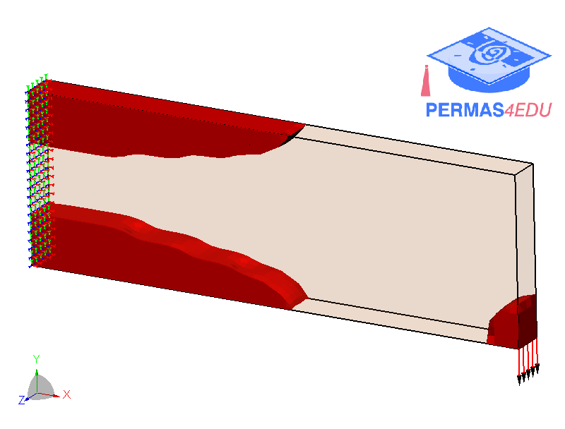
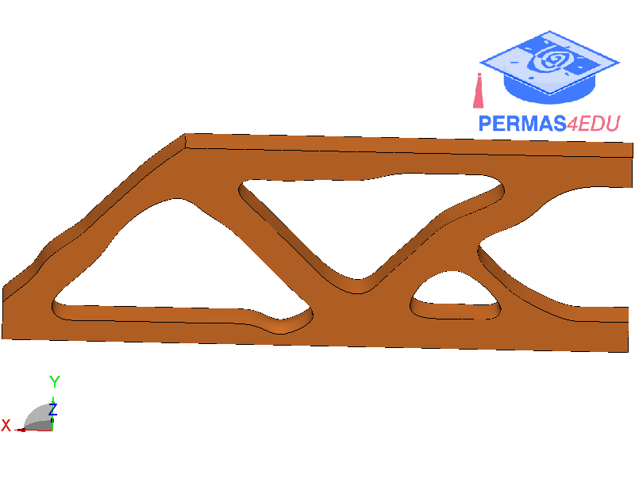

***
[⬅️](../043/README.md "Previous example")
[➡️](../045/README.md "Next example")
***

The example is adapted from [Smooth geometry extraction from SIMP topology optimization: Signed distance function approach with volume preservation](https://doi.org/10.1016/j.advengsoft.2025.104071)

