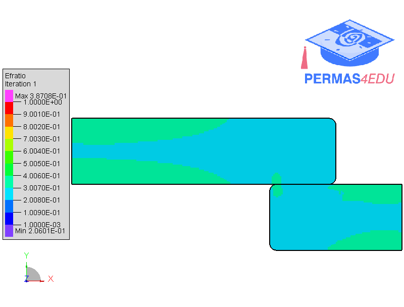

***
[⬅️](../044/README.md "Previous example")
[➡️](../README.md "Go up one directory level")
***

The example is adapted from [Shape and topology optimization for contact applications](https://doi.org/10.1016/j.ijsolstr.2025.113825). Thanks to Filip Sjövall for private communication and sharing a baseline model.
His support is greatly appreciated.

