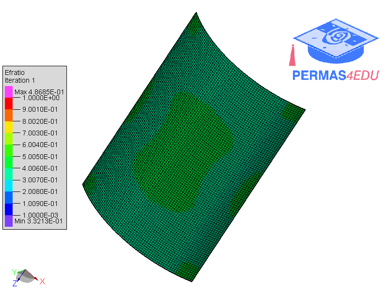

***
[⬅️](../045/README.md "Previous example")
[➡️](../047/README.md "Next example")
***

The example is adapted from [Adaptive isogeometric topology optimization of shell structures based on truncated hierarchical B-splines](https://doi.org/10.1007/s11465-025-0865-z)

