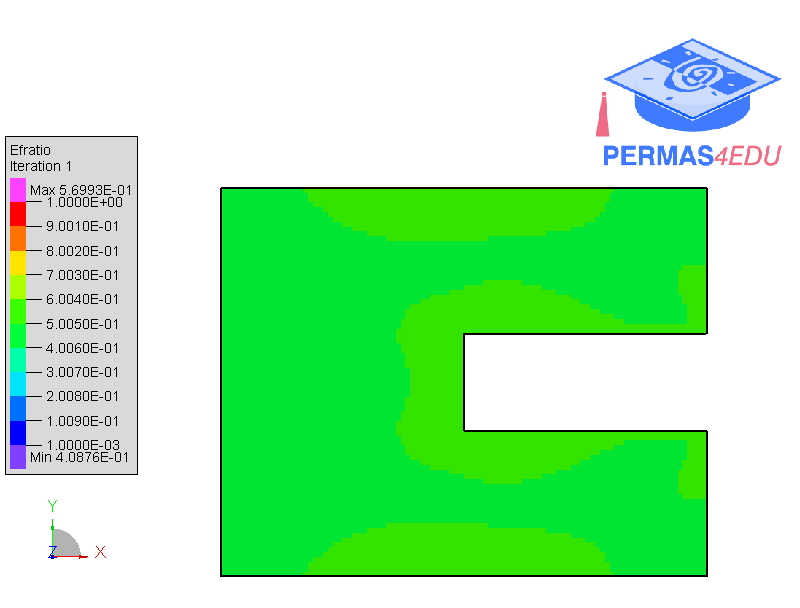
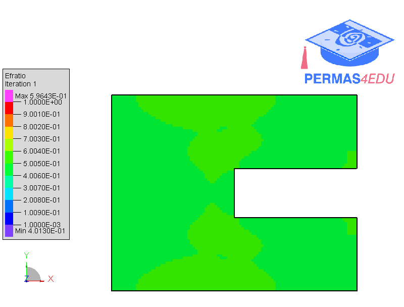

***
[⬅️](../046/README.md "Previous example")
[➡️](../README.md "Go up one directory level")
***

The example is adapted from [A novel topology optimization with load path capacity constraints for minimizing the peak stress control](https://doi.org/10.1063/5.0281681)

### Compliance-based TO

### Stress-based TO

