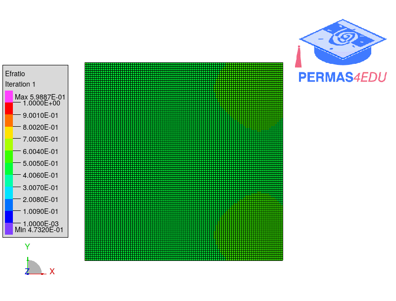
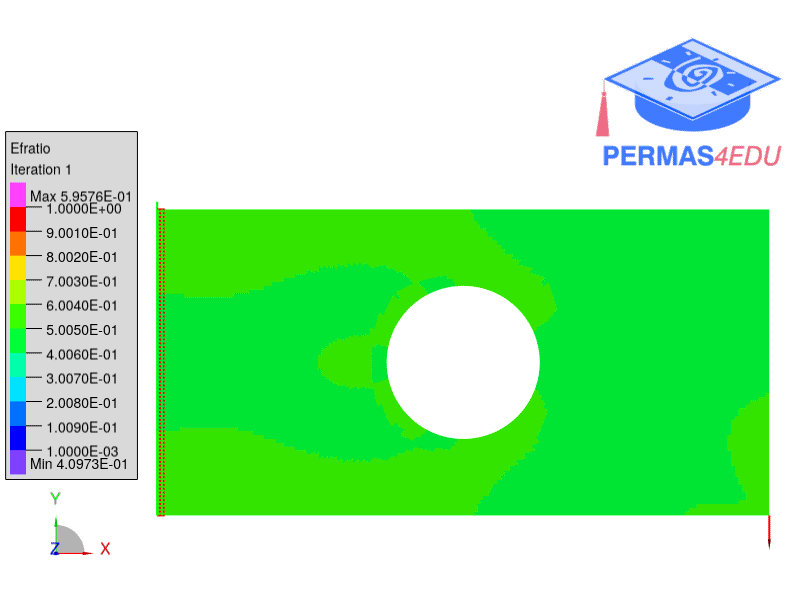

***
[⬅️](../048/README.md "Previous example")
[➡️](../050/README.md "Next example")
***

The examples are adapted from [A dual physics-informed neural network for topology optimization](https://doi.org/10.1016/j.jcp.2026.114666)

