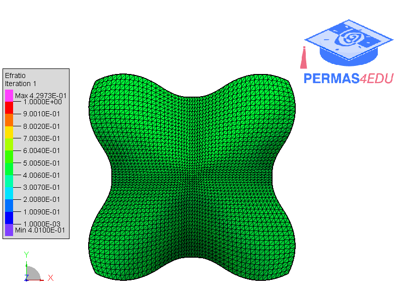

***
[⬅️](../049/README.md "Previous example")
[➡️](../051/README.md "Next example")
***

The example is adapted from [Explicit layout optimization of complex rib-reinforced thin-walled structures via computational conformal mapping (CCM)](https://doi.org/10.1016/j.cma.2022.115745)

Thanks to Wendong Huo for sharing the finite element model and private communication. His support is greatly appreciated.

