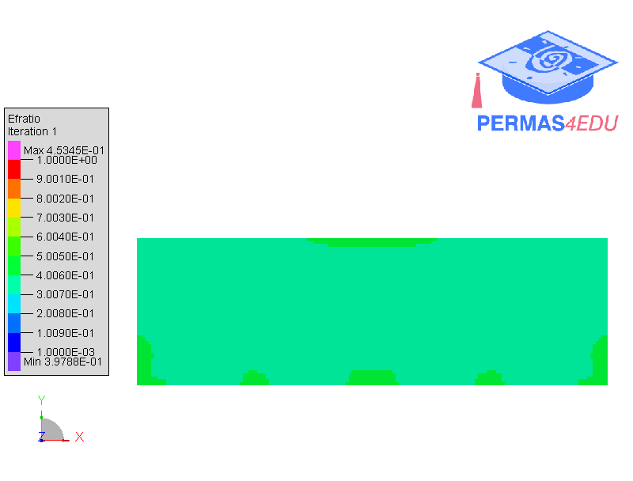

***
[⬅️](../050/README.md "Previous example")
[➡️](../README.md "Go up one directory level")
***

The example is adapted from [A qualitative evaluation and structural analysis of multiple and additive load cases for two‑dimensional Multi‑Material Topology Optimisation in Grasshopper using the Generalised SIMP method](https://doi.org/10.1007/s44223-026-00113-x)

