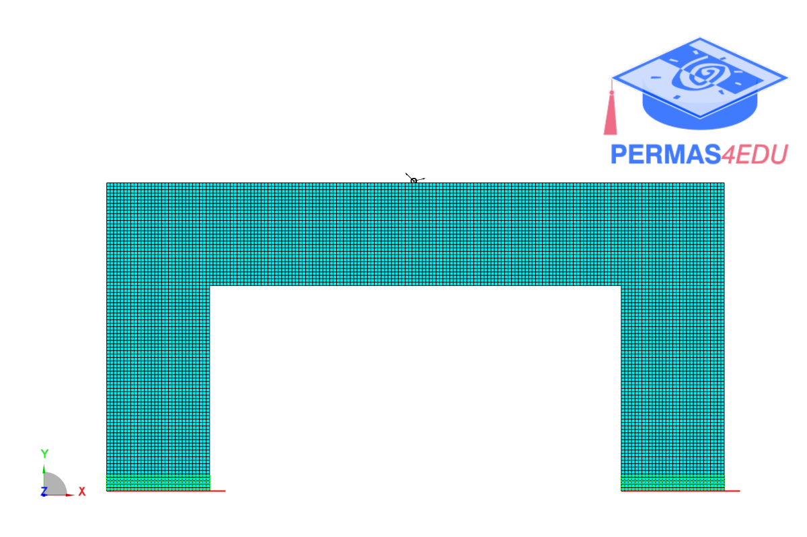
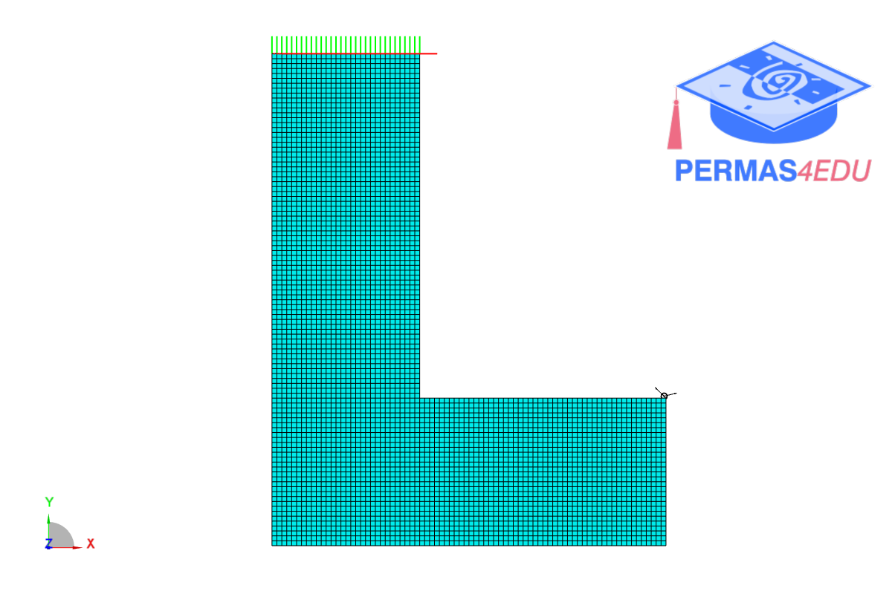

***
[⬅️](../052/README.md "Previous example")
[➡️](../README.md "Go up one directory level")
***

The examples are adapted from [Structural optimization considering smallest magnitude eigenvalues: a smooth approximation](https://doi.org/10.1007/s40430-016-0583-x)

### Portal

### Hook 

