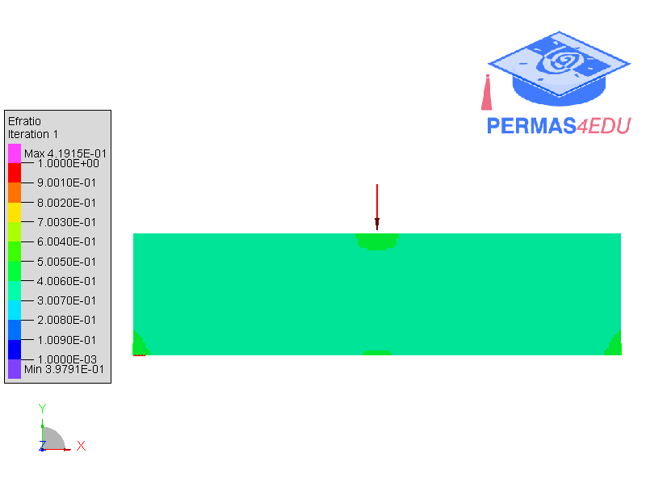

***
[⬅️](../053/README.md "Previous example")
[➡️](../README.md "Go up one directory level")
***

The examples are adapted from [Interactive structural topology optimization via skeleton control](https://doi.org/10.1016/j.cagd.2026.102538)

