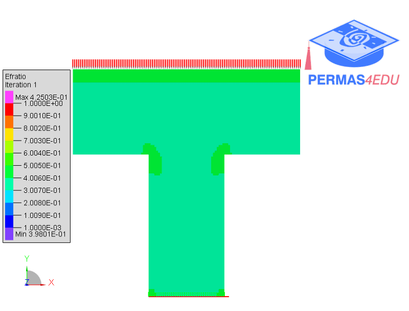

***
[⬅️](../055/README.md "Previous example")
[➡️](../057/README.md "Next example")
***
The example is adapted from [Body-fitted mesh approach for structural topology optimization considering stress constraints](https://doi.org/10.55592/cilamce2025.v5i.14120)

