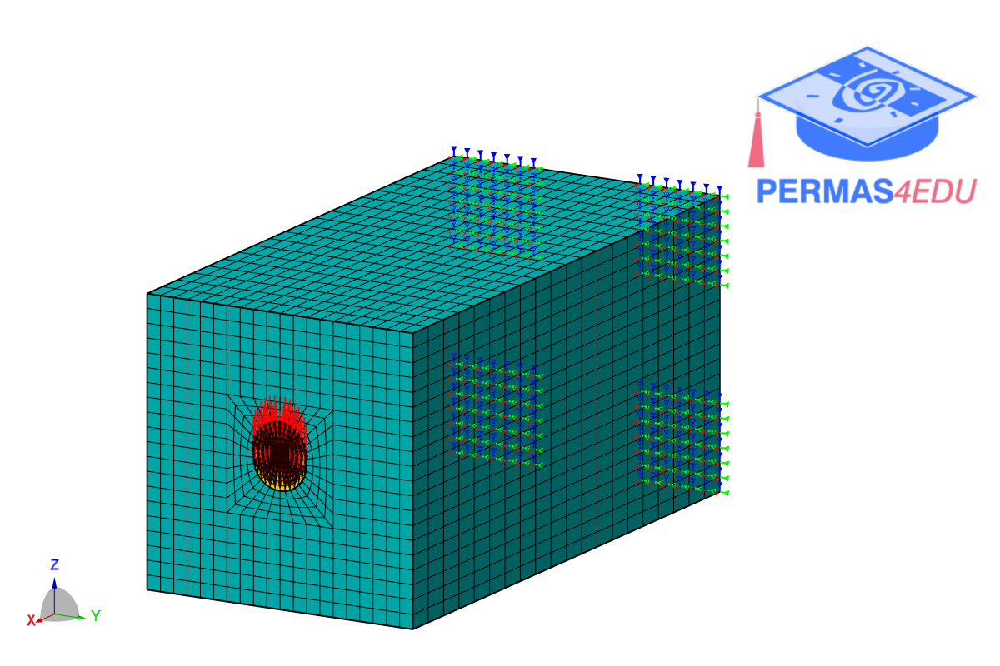

***
[⬅️](../056/README.md "Previous example")
[➡️](../README.md "Go up one directory level")
***
The example is adapted from [Sequential topology optimization: SIMP initialization for level-set boundary refinement](https://doi.org/10.48550/arXiv.2605.04735)

