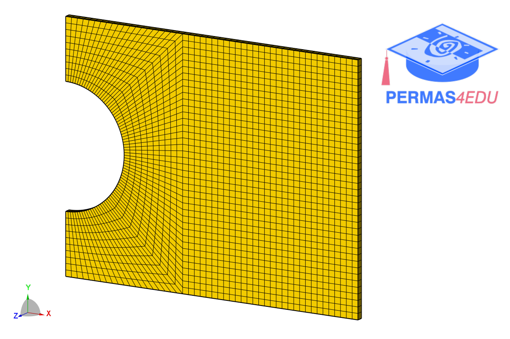

***
[⬅️](../057/README.md "Previous example")
[➡️](../059/README.md "Next example")
***

The example is adapted from [top2iges: A Portable MATLAB Code for Converting Topology Optimization Results into IGES Files with NURBS Representation](https://doi.org/10.1007/s10338-026-00778-x)

