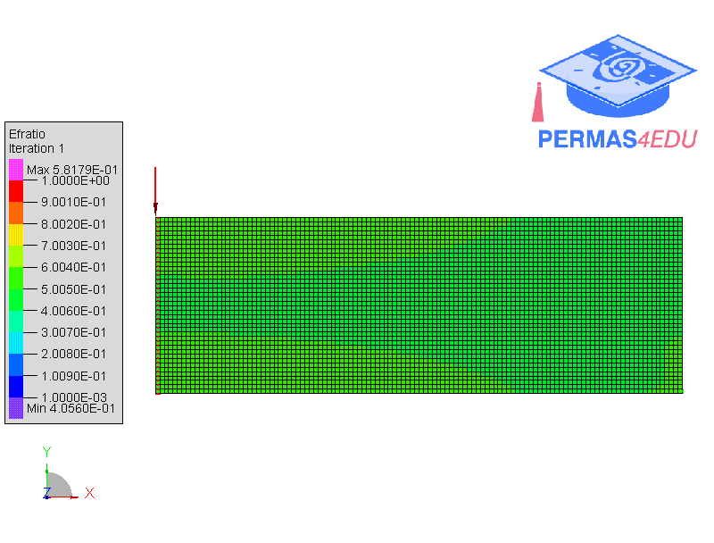

***
[⬅️](../058/README.md "Previous example")
[➡️](../README.md "Go up one directory level")
***

The example is adapted from [Explicit Reconstruction and Shape Optimization of Topology Optimization Results withMechanical Performance Preservation](https://doi.org/10.32604/cmes.2026.079578)

