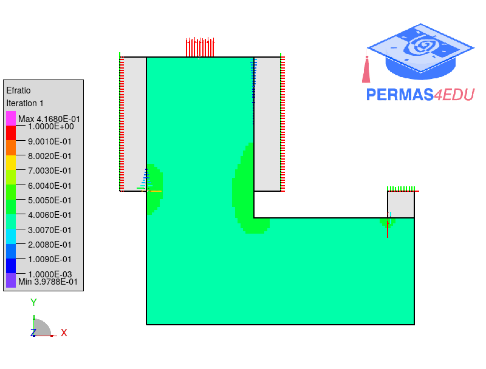
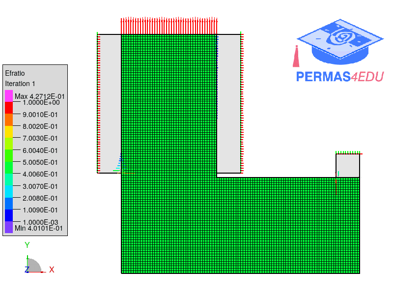

***
[⬅️](../061/README.md "Previous example")
[➡️](../README.md "Go up one directory level")
***
The examples are adapted from [Topology optimization considering contact and stress constraints](https://doi.org/10.1016/j.compstruc.2026.108387)

## L-Bracket with short vertical deformable contact support

## L-Bracket with longer vertical deformable contact support

