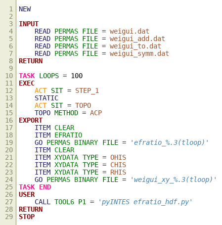
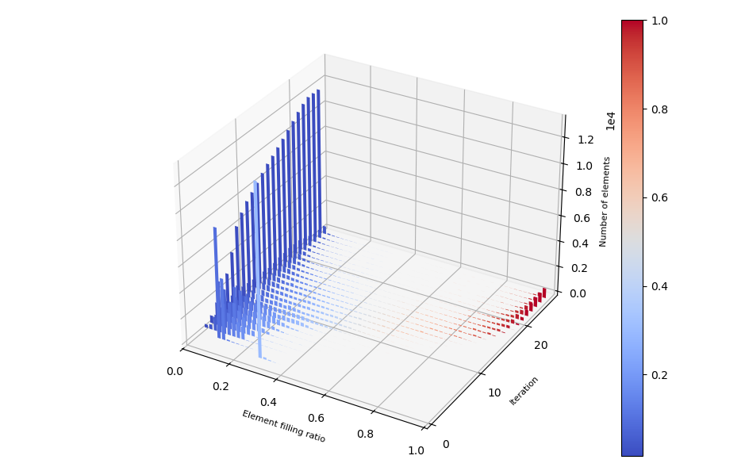

### Solid/Void distribution

Following topology optimisation, the element filling ratio distribution can be displayed as a 3-dimensional histogram. A Python script is called from the user section for this purpose.

### 3D histogram

