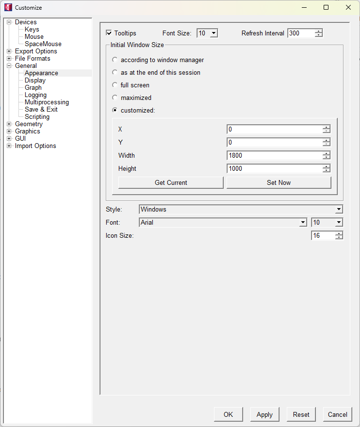
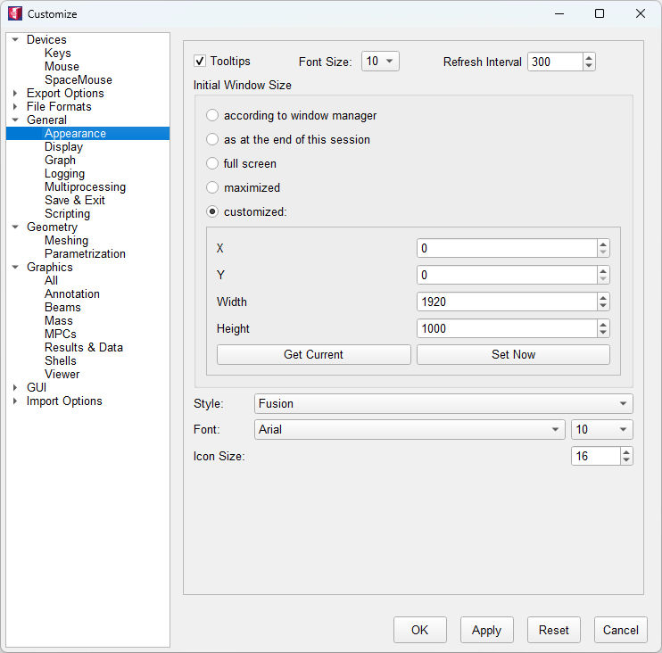
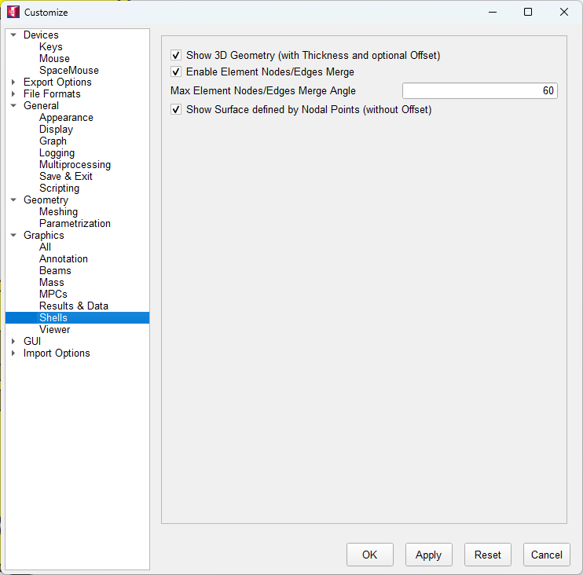

### Frequently Asked Questions

#### Which graphics card is recommended for VisPER?

Nvidia graphics card is preferred.

Whether a computer has multiple graphics cards can usually be determined via the operating system, special software or physical inspection.
Many laptops with ‘hybrid graphics’ typically have both an integrated graphics unit (iGPU) and a dedicated graphics card (dGPU).

In Windows, you can specify which programme should use which graphics card by using the Windows graphics settings or the graphics card manufacturer's software.
In modern versions of Windows (Windows 10, version 2004 and later), the Windows settings usually take precedence.

### How can I select the preferred graphics processor on Windows, e.g. Nvidia or Radeon? 

#### Method 1: Windows Graphics Settings (Recommended)

Beginning with Windows 10 (version 2004 and later) and Windows 11, the operating system's built-in Graphics settings are the primary way to select a preferred GPU for a specific application. This method overrides the settings in the GPU manufacturer's control panel.

    Open the Start Menu and type Graphics settings.

Select the Graphics settings result.

Under "Choose an app to set preference", select either Desktop app (for applications you've installed yourself) or Microsoft Store app (for apps from the Microsoft Store).

If the app is a Desktop app, click Browse and navigate to the .exe file for the program.

Once the app is in the list, click on it and then select Options.

A pop-up will appear with three choices. Select High performance to use your dedicated GPU (e.g., NVIDIA or AMD Radeon) and click Save.

Restart the application for the changes to take effect.

#### Method 2: NVIDIA Control Panel

While Windows Graphics settings are now the primary method, the NVIDIA Control Panel still offers a way to configure GPU preferences.

    Right-click on your desktop and select NVIDIA Control Panel.

In the left-hand menu, go to 3D Settings > Manage 3D Settings.

On the Program Settings tab, select the application from the drop-down list. If the app isn't listed, click Add and browse for its .exe file.

Under "Select the preferred graphics processor for this program", choose High-performance NVIDIA processor.

Click Apply.

#### Method 3: AMD Radeon Software

Similar to NVIDIA, AMD's software allows for GPU selection, particularly for "switchable graphics" laptops.

    Right-click on your desktop and select AMD Radeon Software.

    Navigate to Gaming > Games. 
    You can either select an application that is already listed or use the "Add a Game" button to add a new one.

    Once you select a game, a new panel will appear with various settings. 
    Under "Graphics Profile", choose "Radeon GPU" (for high performance).

### Semi-transparent RenderArea shows other windows behind the VisPER MainWindow

On KDE desktops you can look for the Compositor Settings in the System Settings Module and uncheck the checkbox at Enable compositor at startup.  
On Gnome desktops you may use the environment variable setting

``` 
export XLIB_SKIP_ARGB_VISUALS=1
```

#### Modal dialog (e.g. ChooseElements, ChooseNodes) cannot be moved from RenderArea (Desktop: Gnome)

Gnome decided to behave like MacOS for modal dialog windows [https://en.wikipedia.org/wiki/Modal_window] and forces such a window to stay above its mother window.
For example, if you pick a node in VisPER where more than one node is positioned, the modal ChooseNodes dialog window pops-up and presents a table with all nodes near the picked point. Since you want to see graphical feedback for the referencing element of the selected node in table you may want to move the ChooseNodes dialog away from the RenderArea. This may not be possible if you run VisPER on a Gnome desktop.
To allow modal dialog windows to be moved independent of their mother window on Gnome desktops do the following setting once in a shell console:
``` 
gsettings set org.gnome.mutter attach-modal-dialogs false
```
#### Black screen on Windows

Check the output of dxdiag. This tool is used to collect info about devices to help troubleshoot problems with DirectX sound and video.
Try to manually set the GL Renderer to use your NVIDIA graphics card instead of the Intel HD graphics via the following steps:
* NVIDIA Control Panel 
    + 3D Settings
    + Manage 3D settings
    + Click on “Program Settings” tab
    + Select a program to customize, e.g. C:\Program Files\INTES\EDU\PermVis\M9v20\bin\visper.exe
    + Select the preferred graphics processor for this program: High-performance NVIDIA processor 
    + Click “Apply”

#### Standard colors

There exists several possibilities to modify standard colors in VisPER by using additional definitions in the startup.pm.
The user-specific configuration file startup.pm can be found under
   + ~/.visper/20.0-EDU/startup.pm on Linux
   + %APPDATA%/Intes/VisPER/20.0-EDU/startup.pm on Windows  

* Option I
  
```python
def initColorGenerator(obj):
    obj.labelOffset = 1
```
* Option II

```python
def getColorIndexOfElemGroup(eg):
    if not eg:
        return 0
    return 317 if (eg.index == 1 and eg.typeName == 'Part') else eg.index
```
* Option III

```python
def getColorOfElemGroup(eg):
    return Color(200/255,230/255,200/255) if (eg and eg.index == 1) else eg.index
```

  ### 4K Monitor

  Adjust Windows Display Scaling. **Right-click** on the desktop and select **Display settings**.
  Under **Scale & layout**, choose a recommended scaling level e.g. 100% or 150%

  
 
### Fusion style



### Rendering of beam and shell elements





