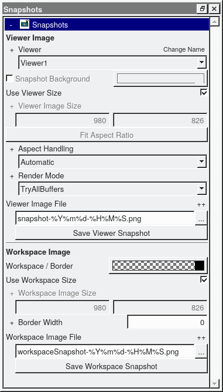

### Introduction

Images of the viewer window can be saved using the Snapshots dialog bar.
To get the best results it is important to know what final resolution of image is needed. 
Higher image resolution does not always result in better images. 
The optimal image resolution has the same size in pixels as the display on which the image should be presented. 
Every interpolation means loss of image quality. For example, if you need to create snapshots for a slide presentation 
and the presentation will be shown using a beamer in FullHD resolution (1920x1080 pixel) and the image will cover 80% of the slide 
in each direction that means you want to take snapshots with an image resolution of about 1536x864 pixels. 
If you show the presentation on a 4k UHD beamer with an aspect ratio of 16:9 your display output may have 3840x2160 pixels, 
in this case the optimal image resolution would be 3072x1728 pixels if it covers 80% of the slide again.

### Placeholders in filenames

The filename of snapshots and videos may contain several placeholders or variables that will be replaced to get the real filename 
under which the snapshot or video will be saved.
Apart from the well known placeholders of date (e.g. %Y-%m-%dT%H:%M:%S will be replaced by current date in ISO 8601 format) 
environment variables may be addressed via an expression like ${USER}.
Furthermore, there are some VisPER-specific placeholders that could be used:

* %R: pixel resolution of image or video, e.g. 1920x1280
* Variables in the context of result visualization with regard to the current tab of the Results&Data dialog can be specified like this
@{VARNAME} where VARNAME is replaced by one of the following
   - COMPONENT - current component
   - CONSTRAINTS - current constraint variant
   - SYSTEM - current system variant
   - LOADING - current loading variant
   - MODIFICATION - current modification variant
   - RESULTS - current result variant
   - COLUMN_SOURCE_NAME - name of the currently visualized result
   - COLUMN_TITLE - column title of the currently visualized result
   - COLUMN_VALUE - column value of the currently visualized result
   - COLUMN_MODE_NUMBER - mode number of an eigenmode
