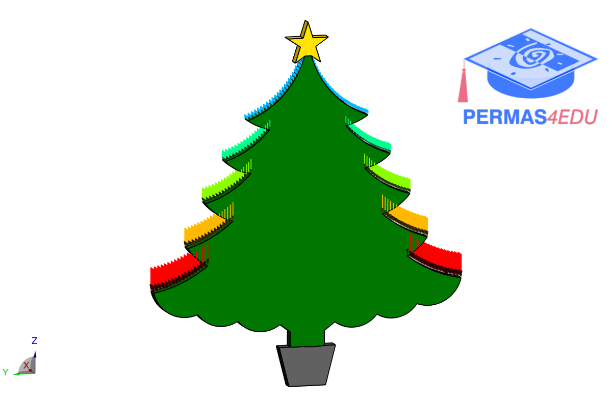

# The Christmas Tree

Once upon a time, there was a little Christmas tree in a deep, enchanted forest. The tree wasn't particularly big or strong, 
but it was chosen for something extraordinary – its structure was to be improved through topology optimization so it could 
bear all the heavy gifts that the Christkind would leave on its branches.

One winter, the process began. A wise forest spirit, who knew much about mathematics and science, came to help the tree. 
The spirit analysed the Christmas tree's structure and examined each tiny branch. Using topology optimization, he imagined the optimal shape, 
where each branch would become stronger and more resilient without losing beauty and elegance.

The spirit experimented with various configurations – changing the thickness of the branches and the angles at which they branched out. 
The tree adapted patiently, its branches became more supple and yet stronger. Soon the Christmas tree looked much more majestic than before, 
ready to bear the load of gifts that would make children's eyes light up.

As Christmas Eve approached, the Christkind came and hung numerous gifts on the tree during a quiet night. 
Thanks to the improved structure, the Christmas tree could bear the weight effortlessly. The village children, 
who came in the morning to collect the gifts, were amazed not only by the large presents but also admired the beautiful and unique tree that displayed them.

Thus, the Christmas tree became the hero of the forest, admired for its strength, beauty, and the miraculous transformation achieved through clever optimization. 
From that day on, the forest dwellers told the story of the Christmas tree whose structure was so perfectly enhanced by science and magic that it could uphold the wonders of Christmas. 
And when the wind softly whispers through the branches, you can still hear the echo of this wonderful transformation.

                     - Generated by ChatGPT
                     

